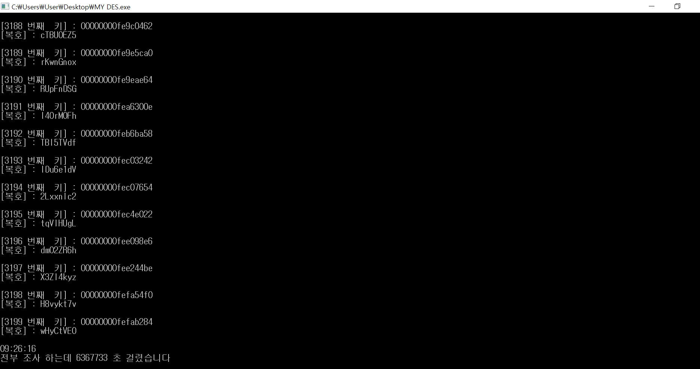
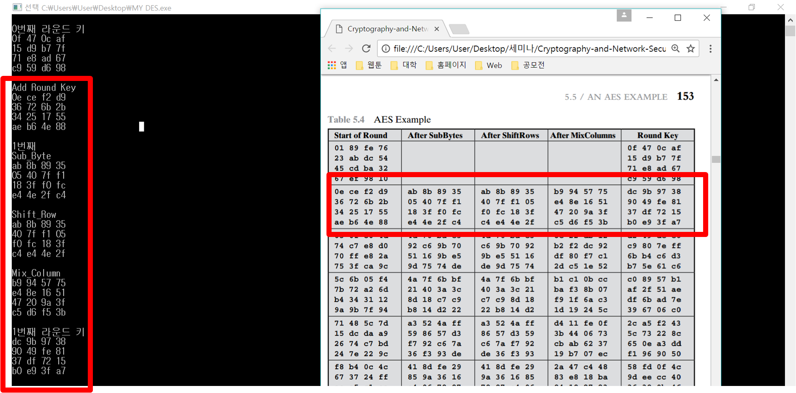
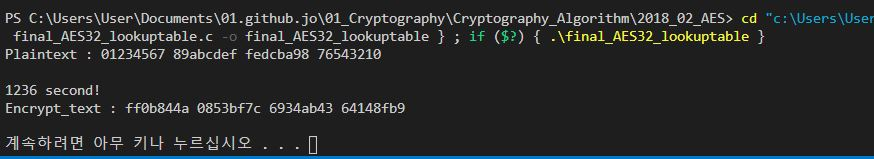

# Cryptography
Cryptography study 2019.7.31 http://cryptocontest.co.kr/

# In Cryptography_Algorithm Repositories

## 1. DES
  ##### 1. DES Algorithm
  
  ##### 2. DES find key (2018)
  
  
  
## 2. AES
  
  ##### 1. AES(2018)
  
  

  ##### 2. AES32 LOOKUP TABLE(2019)  
  - key & encryptoAES 0x80000000 

  
    
 - AES32 NO LOOKUP
  
 - AES32 MC LOOKUP
  
 - AES32 LOOKUP INPUT CHAR